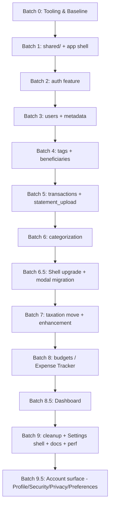

# Frontend Refactoring Plan

> [!NOTE]
> **Planning resolved 2026-05-24.** Modelled on
> [`backend/docs/refactor/implementation_plan.md`](../../../backend/docs/refactor/implementation_plan.md).
> Every `TODO(planning)` from the original scaffold is now locked — see the
> [decision table in CONTRIBUTING.md §10](../../CONTRIBUTING.md#-10-architectural-decisions-resolved--planning-session-2026-05-24).
> Batch 0 is fully specified below; Batches 1–9 will be refined in their own
> sessions.

---

## Goal

Reshape `frontend/src/` from a "by-technical-layer" tree
(`pages/`, `components/`, `state/`, `utils/`) into a **feature-based**
layout under `src/features/<feature>/` that mirrors `backend/app/modules/`.
Along the way, resolve the cross-cutting decisions captured in
[`CONTRIBUTING.md` §10](../../CONTRIBUTING.md): state library, form library,
styling, linting, TypeScript.

**No new product features in this refactor.** Compatibility with the
backend's API surface stays unchanged; the changes are structural.

**Visual upgrade rides along.** The refactor is also the opportunity to
shift the app's visual surface to a modern, sleek, premium look — see
[CONTRIBUTING.md §6 "Visual design language"](../../CONTRIBUTING.md#visual-design-language)
for the target language and operating principle. Every component touched
during a feature batch gets its visuals upgraded in the same pass; do not
re-skin the pre-refactor plain look behind Tailwind utilities.

---

## User Review Required & Design Decisions

> [!IMPORTANT]
> **1. Tooling baseline (Batch 0)** — locked. The full toolchain is in
> [CONTRIBUTING.md §3](../../CONTRIBUTING.md#-3-tooling--workflow) and §10.
> Summary: ESLint flat + Prettier, **TypeScript strict** (migrate per-feature
> as each batch moves files), **TanStack Query v5** for server state,
> **Zustand** for client state (first store: `useAuthStore`),
> **react-hook-form + Zod** for forms, **Tailwind v4** for styling,
> **MSW** for backend mocking in tests, `createBrowserRouter` + per-feature
> `RouteObject[]` for routing, **`size-limit`** for the bundle gate.

> [!IMPORTANT]
> **2. Feature naming follows the backend**
> Feature folders use the same vocabulary the backend uses (`auth`, `users`,
> `metadata`, `tags`, `beneficiaries`, `transactions` + `statement_upload/`,
> `categorization`, `taxation`, `budgets`). Anyone working across the stack
> can `cd backend/app/modules/<X>` and `cd frontend/src/features/<X>` and see
> the matching pair.

> [!IMPORTANT]
> **3. Per-batch frontend tests must stay green**
> `npm test` is the gate. Each batch ends with all existing test files
> passing under their new locations.

> [!WARNING]
> **No backend-shape changes in this refactor.**
> If a frontend change requires touching `/api/...` shapes, defer it to a
> backend follow-up rather than coupling the two refactors.

---

## Proposed Refactoring Batches



### Batch 0 — Tooling & Baseline

Order matters: each step assumes the prior one is in place. Use WIP commits
locally between steps as rollback checkpoints, but **do not push them** —
at the end of the batch, soft-reset and condense to a single
`Frontend Batch 0: tooling baseline (…)` commit before pushing. The
refactor branch carries one commit per batch, not one per step (bisect
granularity is batch-level — see [`.scratch/task-frontend.md`](../../../.scratch/task-frontend.md)
"Workflow" for the soft-reset recipe).

1. **ESLint + Prettier.** Install: `eslint@^9`, `@eslint/js@^9`,
   `eslint-plugin-react`, `eslint-plugin-react-hooks`,
   `eslint-plugin-jsx-a11y`, `eslint-plugin-import`,
   `eslint-config-prettier`, `prettier`, `prettier-plugin-tailwindcss` (used
   from step 7 onwards but install now to avoid a follow-up config bump).
   **ESLint pinned to v9 deliberately:** ESLint 10 released in early 2026
   but `eslint-plugin-import@2.32.0` and several other plugins still declare
   their peer range as `^9` only — installing `eslint@*` resolves to v10 and
   produces `ERESOLVE` errors. v9 still ships flat config (the planning
   decision); we revisit v10 once the plugin ecosystem catches up.
   Flat config in `eslint.config.js`. `import/no-restricted-paths` rule
   pre-wired with the eventual `features → shared` boundary. Run
   `npm run format -- --write` over the existing tree as a single commit so
   future batches' diffs stay clean.
2. **TypeScript.** Install: `typescript@~5.9` (pinned because
   `openapi-typescript@7.x` does not yet support TS 6.x), `@types/react@^18`,
   `@types/react-dom@^18` (**pinned to v18 to match the React 18.3 runtime
   — installing `@types/react@latest` resolves to v19 and produces
   load-bearing type errors against React 18 code, including the
   `useRef<T>()` signature change and the removal of the implicit `children`
   prop**). `tsconfig.json` with `strict`, `noUncheckedIndexedAccess`,
   `allowJs`, `jsx: "react-jsx"`. Convert `src/main.jsx` → `src/main.tsx`
   and `src/App.jsx` → `src/App.tsx` as the smoke proof. Add
   `vite-tsconfig-paths` if path aliases (`@/...`) are wanted. Strategy for
   batches 1–8: "convert each file as its feature batch moves it" — no
   second sweep.
3. **OpenAPI types.** Install: `openapi-typescript`. `npm script gen:api` →
   `openapi-typescript http://localhost:4000/openapi.json -o src/shared/types/api.ts`.
   Not run in CI; regenerated on demand. Commit the first generation so types
   are available before Batch 1.
4. **TanStack Query.** Install: `@tanstack/react-query` +
   `@tanstack/react-query-devtools`. Wire `QueryClientProvider` in
   `src/App.tsx` (moves to `src/app/providers.tsx` in Batch 1). Sensible
   defaults: `staleTime: 30_000`, `refetchOnWindowFocus: false`, retry: 1.
   Smoke test: a `useQuery` against a stub endpoint in MSW (step 8).
5. **Zustand.** Install: `zustand`. Skeleton `src/state/auth.store.ts` (no
   real login wiring yet; just `user: null` + a `set` action). Moves to
   `src/features/auth/state/` in Batch 2. Smoke test asserts the store
   exists and updates.
6. **react-hook-form + Zod.** Install: `react-hook-form`, `zod`,
   `@hookform/resolvers`. No code yet — confirmed by `tsc --noEmit`.
7. **Tailwind CSS v4.** Install: `tailwindcss@4`, `@tailwindcss/vite`. Add
   the Vite plugin in `vite.config.ts`. Create `src/index.css` with
   `@import "tailwindcss";` and an empty `@layer components`. Replace one
   existing button's CSS with Tailwind utilities as smoke proof. Configure
   `prettier-plugin-tailwindcss` in `.prettierrc`.
8. **MSW.** Install: `msw`. Create `src/test/server.ts`,
   `src/test/handlers/health.ts` (one stub endpoint),
   `src/setupTests.ts` updated to start/stop the server with
   `beforeAll`/`afterAll` and `resetHandlers` between tests. Convert the
   existing `vi.mock(apiClient)` tests **only if** trivial; defer the bulk
   migration to each feature's batch.
9. **size-limit.** Install: `size-limit`, `@size-limit/preset-app`.
   `.size-limit.json` with two entries: initial bundle ≤ 120 KB gz,
   per-feature lazy chunk ≤ 80 KB gz. **Not yet a CI gate** — Batch 9 wires
   that. Record current numbers in `docs/performance.md`.
10. **Docs skeleton.** Create `frontend/docs/{architecture,testing,performance}.md`
    and an empty `frontend/docs/modules/` folder. `architecture.md` gets a
    one-paragraph stub pointing at CONTRIBUTING.md.
11. **Gate.** `npm run lint`, `npm test`, `npm run build`, `npm run size`
    all green. Commit the final state as
    `Frontend Batch 0: tooling baseline (ESLint, TS, RQ, Zustand, RHF+Zod, Tailwind, MSW, size-limit)`.

### Batch 1 — `shared/` + app shell

- [ ] Create `src/shared/{api,components,hooks,utils,types}/`. (`types/api.ts`
      already exists from Batch 0 step 3.)
- [ ] Move + convert `src/utils/{apiClient,dateUtils,validation}.js` →
      `src/shared/{api,utils}/*.ts`. Update every import.
- [ ] Move + convert `src/components/{ErrorBoundary,ProtectedRoute,PasswordRequirements}.jsx`
      → `src/shared/components/*.tsx`.
- [ ] Carve `src/app/` out of `src/App.tsx`: `App.tsx` (root layout),
      `routes.tsx` (`createBrowserRouter` composer — starts with an empty
      array, populated by feature batches), `providers.tsx` (composed:
      `QueryClientProvider` + global `<ErrorBoundary>` + Suspense fallback +
      `useAuthStore.hydrate()` call on mount).
- [ ] Add a `protectedRoutes(routes)` helper in `src/app/routeHelpers.ts`
      that wraps each `RouteObject` so its `element` is gated by
      `<ProtectedRoute>` — used by Batches 3–8 when their routes are added.
- [ ] **User-preferences plumbing (currency + timezone)** — see
      [CONTRIBUTING.md §5 "User preferences contract"](../../CONTRIBUTING.md#user-preferences-contract-currency--timezone)
      for the full spec.
      - `src/shared/state/preferences.store.ts` — `usePreferencesStore`
        (Zustand + `persist`), shape
        `{currency: string; country: string | null; timezone: string;
        setPreferences(p): void; reset(): void;}`. Defaults: `currency:
        'USD'`, `country: null`, `timezone: 'UTC'`. Lives in `shared/`
        because `apiClient.ts` reads from it.
      - `src/shared/api/apiClient.ts` — extend the existing header build
        to also inject `x-user-currency` and `x-user-timezone` from the
        store on every request (read via
        `usePreferencesStore.getState()` — outside React render path).
      - `src/shared/utils/currency.ts` — new module with
        `formatMoney(amount, code, symbol)` returning
        `${symbol}${formatted}` when symbol present, `${code}
        ${formatted}` when null. Includes `parseMoney` if any input form
        needs the inverse (likely not in Batch 1).
      - `src/shared/utils/dateUtils.ts` — extend with tz-aware helpers:
        `formatDate(iso, tz, opts)`, `formatDateTime(iso, tz, opts)`,
        `todayInUserTz(tz)` (returns local-tz `YYYY-MM-DD` for
        date-input defaults), `localToUtcIso(localDateString, tz)`
        (form-submit inverse).
      - No real prefs flowing yet — the store always returns defaults
        until Batch 2 wires the login flow. Smoke test asserts the two
        headers appear on a sample `apiFetch` call when store values
        are non-default.
- [ ] **Theme infrastructure (dark / light / system) + header toggle:** - `src/shared/state/theme.store.ts` — `useThemeStore` (Zustand +
      `persist` middleware) with modes `'light' | 'dark' | 'system'`,
      default `'system'`. Subscribes to `prefers-color-scheme` for the
      system mode. - `src/shared/components/ThemeToggle.tsx` — small icon button
      (sun / moon / monitor) cycling through the three modes. Mounted
      top-right of the app header in `src/app/App.tsx`. - Tailwind v4 class-based dark strategy in `src/index.css`:
      `@variant dark (&:where(.dark, .dark *));`. - `index.html` — synchronous inline script (~10 lines) that reads
      the persisted theme from `localStorage` and sets
      `<html class="dark">` _before_ React renders. Prevents FOUC flash
      on initial load. - `src/app/providers.tsx` — `useThemeStore.hydrate()` and effect
      that mirrors store state to the `<html>` class on every change. - Install `lucide-react` (~3 KB tree-shaken) for the icons. Not a
      §10-locked decision; added as the conventional icon dep. - Settings-page placement of the toggle is added later in Batch 3
      when the users feature lands.
- [ ] `npm test` green; no functional change to existing features.

### Batch 2 — `auth` feature

- [ ] Move + convert `src/pages/user/{Login,Register}.tsx` + tests →
      `src/features/auth/pages/`.
- [ ] Move + convert `src/state/AuthContext.jsx` → `src/features/auth/state/auth.store.ts`.
      Replace Context API with the Zustand `useAuthStore` skeleton from
      Batch 0; add real `login`/`logout`/`refresh` actions backed by the
      `api/mutations.ts` hooks. Add `persist` middleware for the access
      token. Delete `AuthContext.jsx`.
- [ ] Move every recovery-related page → `src/features/auth/recovery/`.
- [ ] Extract `src/features/auth/api/`: `schemas.ts` (Zod for login /
      register / recovery request bodies), `queries.ts` (`useCurrentUserQuery`),
      `mutations.ts` (`useLoginMutation`, `useRegisterMutation`, etc.),
      `keys.ts`. All inline fetch sites migrate to these hooks.
- [ ] Rebuild forms with `react-hook-form` + `zodResolver` against the same
      schemas.
- [ ] `src/features/auth/auth.routes.tsx` exports a `RouteObject[]` with a
      per-route `errorElement` (`<AuthErrorFallback />`). Consumed by
      `src/app/routes.tsx`.
- [ ] MSW handlers under `src/test/handlers/auth.ts`. Drop the per-test
      `vi.mock(apiClient)` calls.
- [ ] **Register form: timezone field + smarter locale defaulting.**
      - **Replace** the existing 6-country hardcoded locale switch
        (`if region === 'IN'… else if 'US'…`) with `Intl.DisplayNames`:
        `new Intl.DisplayNames(['en'], { type: 'region' }).of(region)`
        returns the country's English name → match against the
        `/api/metadata/countries` list. Covers all ~250 ISO regions,
        zero hardcoded mapping. No IP geolocation (privacy/dependency
        cost not worth marginal accuracy on a register form).
      - **New `<TimezoneSelect />` component** in
        `src/features/metadata/components/TimezoneSelect.tsx`. Owned by
        the metadata feature (Batch 3 reuses it on Profile), built
        early in Batch 2 because Register needs it. Behavior driven by
        the selected country's timezone cardinality:
        - **Country has one timezone** → render read-only field with
          that tz; "Use a different timezone" expand-link reveals the
          full-IANA fallback dropdown.
        - **Country has multiple timezones** → render dropdown of *that
          country's* timezones, defaulted to the backend's primary
          (`country.timezone` from the metadata API). Same "Use a
          different timezone" expand-link for users physically located
          outside their country of residence.
        - **Country unknown / "Rather not say"** → full IANA dropdown
          via `Intl.supportedValuesOf('timeZone')`, defaulted to
          browser's `Intl.DateTimeFormat().resolvedOptions().timeZone`.
      - **Country→timezones data source:** install
        `countries-and-timezones` (~30 KB gz tree-shaken). Lazy-loads
        with the auth chunk; first-paint not affected. Wrapped behind
        a tiny `src/shared/utils/countryTimezones.ts` so the swap to a
        backend-sourced list (when the queued follow-up lands —
        see "Backend follow-ups" below) is one-file.
      - **Register payload** now includes `timezone: string`. Backend
        accepts it via the existing profile/preferences flow (timezone
        is currently transient via `UserPreferencesMiddleware`; persist
        on the profile if the backend follow-up adds the column).
- [ ] **Hydrate `usePreferencesStore` from `/api/users/preferences`:**
      - On successful login: `useLoginMutation.onSuccess` →
        `GET /api/users/preferences` → `usePreferencesStore.setPreferences(...)`.
      - On token refresh (`apiClient.ts` refresh path): re-fetch
        preferences (covers profile-changed-on-another-device case).
      - On logout: `usePreferencesStore.reset()` back to USD/UTC defaults.
      - MSW handler at `src/test/handlers/users.ts` (placeholder for
        Batch 3's full users handler) returns a sample preferences
        payload for the login smoke test.
- [ ] `npm test` green.

### Batch 3 — `users` + `metadata` features

- [ ] Move `src/pages/user/ProfilePage.jsx` + tests → `src/features/users/pages/`.
- [ ] If the registration form's country/currency dropdowns currently live in
      `Register.jsx`, factor them out into `src/features/metadata/components/`
      (CountrySelect, CurrencySelect — both consume `/api/metadata/*`).
- [ ] **Currency dropdown shows `${code} (${symbol})`** (fallback to just
      `${code}` when `symbol` is null). Lives in
      `features/metadata/components/CurrencySelect.tsx`.
- [ ] **`CountrySelect` auto-populates timezone** from the selected
      country's metadata `timezone` field — saving the profile with a
      new country updates both `country` and the active `timezone`. Allow
      user to override timezone explicitly via a separate dropdown if
      country's default doesn't match (e.g. user in a different tz than
      their nationality).
- [ ] **On profile save**: after the PATCH/PUT succeeds, re-fetch
      `/api/users/preferences` and call
      `usePreferencesStore.setPreferences(...)` so all open tabs see the
      new currency/tz immediately (also re-renders every component
      using `formatMoney`/`formatDate`).
- [ ] **`features/users/api/queries.ts`** owns the `useUserPreferencesQuery`
      hook (used by Batch 2's login flow and this batch's profile page;
      both invalidate it on mutation).
- [ ] `npm test` green; write `docs/modules/users.md` and
      `docs/modules/metadata.md`.

### Batch 4 — `tags` + `beneficiaries` features

- [ ] Move `src/pages/user/settings/CategoriesTab.jsx` (tags UI) →
      `src/features/tags/`.
- [ ] Move `src/pages/beneficiaries/*` → `src/features/beneficiaries/`.
- [ ] Add `src/features/<feature>/api/` for each.
- [ ] `npm test` green.

### Batch 5 — `transactions` + `statement_upload`

- [ ] Move `src/pages/transactions/*` → `src/features/transactions/pages/`.
- [ ] Statement-upload UI nests as `src/features/transactions/statement_upload/`
      to mirror the backend.
- [ ] Add `src/features/transactions/api/` (list / get / create / update /
      delete + statement-upload pipeline).
- [ ] `npm test` green.

### Batch 6 — `categorization`

- [ ] Move `src/pages/user/settings/CategorizationRulesTab.jsx` →
      `src/features/categorization/`.
- [ ] `npm test` green.

### Batch 6.5 — Shell upgrade + modal-first CRUD migration

Inserted mid-refactor (planned 2026-05-26) after Batch 6 surfaced two
gaps: (1) Batch 6's modal pattern for adding beneficiaries / grouping
rules is a clear UX win that earlier batches' page-based CRUD doesn't
share; (2) several module routes are orphaned without a unified
navigation surface. Lands **before** Batch 7 so Batches 7–8 adopt the
new shell + modal pattern natively rather than being retrofitted later.

**Scope is structural, not visual polish.** Touches `src/shared/`
heavily, `src/app/` for the layout root, and retrofits Batches 2–6's
features to use the new pattern. Estimated 1–2 focused sessions
(comparable to a regular batch).

- [ ] **Layout shell — top-nav-primary, 4-group IA, no desktop sidebar.**
  Locked 2026-05-26. Top bar is the only navigation surface on both
  desktop and mobile. Conceptual grouping: (1) Brand/Home, (2) Main
  features, (3) Settings, (4) User. Dashboard's existing in-page
  summary cards cover any "glance value" use case the sidebar would
  have provided.

  - `src/shared/components/TopNav.tsx` — replaces the current minimal
    header. Built on `@radix-ui/react-dropdown-menu` for both the
    Settings and User dropdowns (~3 KB gz; same Radix family as the
    Dialog dep). Active route in the Main group gets indigo bottom
    border (per §6 accent lock).

  - **Desktop (≥1024 px) layout:**
    ```
    [Brand]  Transactions  Expense Tracker  Tax Tracker   [☼] [About] [⚙ ▾] [👤 ▾]
              \____________ Group 2 (Main) ____________/   ↑    ↑       ↑      ↑
                                                         theme  link   Settings  User
    ```
    - **3 inline Main-feature links** (Group 2). Labels:
      `Transactions` (route `/transactions`), `Expense Tracker` (route
      `/budgets` — renamed for clarity per the user's framing;
      route URL stays `/budgets` to avoid breaking deep-links and
      bookmarks; consider URL rename as a separate Batch 9 audit item),
      `Tax Tracker` (route `/taxation` — same URL-stays rationale).
    - **Theme toggle (`☼`)** — existing pattern, kept.
    - **About** — single href to `/` (landing page). Visible only when
      authenticated (logged-out users are already on `/` or auth pages
      and don't need the link).
    - **Settings dropdown (`⚙ ▾`)** — Radix DropdownMenu, click to
      open. Items: Categories (→ `/settings/categories`), Categorization
      Rules (→ `/settings/categorization-rules`), Beneficiaries
      (→ `/beneficiaries`), Taxation Rules (→ `/taxation/rules` or
      whatever the current route is — verify against Batch 7 plan).
    - **User dropdown (`👤 ▾`)** — Radix DropdownMenu, click to open.
      Items: Profile (→ `/profile`), Sign Out (action, no route).
      Preferences merged into ProfilePage as a section rather than its
      own route (decision 2026-05-26 — sharper separation deferred).

  - **Brand link 3-state behavior:**
    - `localStorage.getItem('refresh_token')` present + valid →
      `/dashboard`.
    - `refresh_token` present but invalid (returning visitor, session
      expired) → `/login`. apiClient.ts's existing 401-then-refresh
      flow handles this automatically when the user tries to load
      `/dashboard`, so the brand can simply link to `/dashboard` in
      this case and the redirect chain does the work.
    - No `refresh_token` at all (true first visit) → `/` (landing).

  - **Mobile (<1024 px) layout:** `[☰] [Brand]   [☼] [👤 ▾]` —
    hamburger left, brand next to it, theme + user dropdown right.
    Drawer contents below.

  - **Mobile drawer (grouped):**
    ```
    [Brand]                                    ×
    ─────────────────────
    MAIN
      Transactions
      Expense Tracker
      Tax Tracker
    ─────────────────────
    SETTINGS
      Categories
      Categorization Rules
      Beneficiaries
      Taxation Rules
    ─────────────────────
    ABOUT
    ─────────────────────
    Profile
    Sign Out
    ```
    - Group labels are visual section dividers (small caps, muted
      text-xs). Items below each label are full-tap-target rows
      (≥44 px per §1 Platform target).
    - Theme toggle stays in the top bar (not in the drawer) so users
      don't need to open the drawer to switch theme.
    - User dropdown's Profile / Sign Out items appear both in the top
      bar dropdown (when avatar is tapped) AND in the drawer bottom
      section — redundancy is fine here; both are common reach paths.

  - **No `useUIStore`** anymore — drawer state is local component
    state in the mobile hamburger only; no cross-page persistence
    value.

  - Responsive contract from CONTRIBUTING.md §1 "Platform target" is
    honored: no horizontal body scroll ≥ 320 px, ≥ 44 px touch
    targets in the drawer, top bar reflows cleanly at every breakpoint.

- [ ] **Modal primitive in `shared/`.**
  - `src/shared/components/Modal.tsx` — focus trap, escape-key close,
    backdrop click close (configurable), ARIA `dialog` semantics,
    sizing variants (`sm` / `md` / `lg` / `xl`). Built on **Radix UI's
    Dialog** (`@radix-ui/react-dialog`, ~5 KB gz) for battle-tested
    accessibility — adding the dep is justified by the breadth of
    modal usage in this batch.
  - `src/shared/hooks/useModal.ts` — open/close state management with
    optional URL-state sync for deep-linking (e.g.,
    `/transactions?add=true` opens the add-transaction modal).
  - Pattern documented in CONTRIBUTING.md §6 "Modal pattern" so
    Batches 7–8 follow it natively.

- [ ] **Modal-first CRUD migration — content features (Batches 4–6 retrofit).**
  - **Transactions** (Batch 5 retrofit): list page hosts add / edit /
    view modals. Routes `/transactions/add` and `/transactions/edit/:id`
    get rewritten as the list route with modal-state in the URL
    (`?add=true`, `?edit=<id>`). Page-based fallback removed.
  - **Beneficiaries** (Batch 4 retrofit): list page hosts add / edit /
    view / delete-confirm modals. The add-beneficiary modal already
    landed in `8db2861` (post-Batch 6) — extend to edit/view/delete.
  - **Tags** (Batch 4 retrofit): settings tab hosts add / edit / delete
    modals; rule grouping modal from `8db2861` stays.
  - **Categorization** (Batch 6 retrofit): rules tab hosts add / edit /
    delete-rule modals.

- [ ] **Hybrid auth: keep `/login` and `/register` pages, add modal
      flow from Home.**
  - Home page gains "Sign In" CTA → opens `<LoginModal />`; modal has
    "Register" link → switches to `<RegisterModal />`. Successful
    auth: close modal, redirect to `/dashboard` (matches page-flow
    behavior).
  - `/login` and `/register` routes preserved for deep-links, password
    manager autofill, and screen-reader users who prefer page-based
    flows.
  - Auth form components extracted from `LoginPage` / `RegisterPage`
    into shared `<LoginForm />` / `<RegisterForm />` under
    `features/auth/components/`. Both the page wrapper and the modal
    wrapper compose the same form. **No form-state duplication.**

- [ ] **Verification.**
  - `npm test` green (existing tests + new modal smoke tests + sidebar
    state tests + URL-state hook tests).
  - Manual click-through: at viewports 320 / 768 / 1024 / 1440 px in
    both light and dark mode. Every CRUD flow modal opens, accepts
    input, submits, closes; sidebar collapses/expands; theme toggle
    works; user menu works.
  - `npm run build` + `npm run size` — bundle stays within budgets
    (`@radix-ui/react-dialog` adds ~5 KB gz to shared chunk).

- [ ] **Searchable list with inline create** — cross-app UX pattern
      locked in the 2026-05-26 Batch 6.5 follow-up review (full
      contract in CONTRIBUTING.md §6 "Searchable list with inline
      create"). **Apply this pattern in any picker meeting BOTH:**
      1. A finite list of candidate values to choose from.
      2. The user is allowed to add new values to that same list.
      The picker is a search input + dropdown of filtered matches,
      with `+ Add new <singular>` as the always-visible sticky first
      item in the dropdown. Clicking the CTA opens the corresponding
      `<FooFormDialog />`; on save, the source list refreshes and
      the new entry is auto-selected (single) or auto-appended
      (multi). Batch 6.5 applies it to the beneficiary picker
      (transactions + categorization rules) and the tag picker
      (categorization rules + transactions); Batches 7–8 must use
      it natively wherever the conditions hold (e.g. budget-tag
      picker, taxation-rule tag picker). DO NOT apply to fixed
      catalog selects (country, currency, timezone) where the user
      cannot add entries — a plain `<select>` stays correct there.
      Reason to extract a shared `<SearchableList />` component:
      only when a fourth surface adopts the same single/multi
      shape; until then the copy-paste keeps each surface free to
      paint feature-specific chip enrichment (Primary tag, alias
      bracket display) without a shared-API redesign.

- [ ] Doc updates as part of the batch commit:
  - CONTRIBUTING.md §6 — new "Modal pattern" subsection (when to use,
    when not, accessibility, URL-state sync) AND new "Searchable
    list with inline create" subsection (anchor invariants +
    reference implementations).
  - `docs/architecture.md` — sidebar / topbar / modal sections added
    to the shell description.
  - `docs/modules/<feature>.md` for each retrofitted feature — list /
    detail / modal flow described.

### Batch 7 — `taxation` (move + Tax Tracker enhancement)

Scope expanded 2026-05-26 from "move only" to include enhancement.
Reason: Batch 8.5 (Dashboard) needs a "Tax Tracker" card surface, and
the current bills-list-only view doesn't give Dashboard enough to
show. Building those surfaces in Batch 7 means Dashboard's card lands
in 8.5 against the final shape.

- [ ] Move `src/pages/tax/*` → `src/features/taxation/pages/` (adopts
      Batch 6.5's shell + modal pattern natively; no retrofit needed).
- [ ] Surface taxation rules + consumption-tax bills under a single
      feature route group.
- [ ] **Tax Tracker enhancement** (new surfaces added during the move):
      - **Current week running tax** — live accrual against
        in-progress week's transactions (not just past finalized bills).
        Pulls from `consumption_tax_txns` + an as-yet-unbilled
        aggregator endpoint (verify backend exposes this; if not,
        queue as a backend follow-up and ship with finalized bills
        only for now).
      - **Per-category tax contribution** — breakdown of the current
        week's tax by tag (which categories are driving the bill).
      - **Forecast / projection** — extrapolation of week-to-date
        spending to predicted week-end tax. Simple linear projection
        based on day-of-week elapsed.
      - **Penalty breakdown** — for finalized bills, which budget
        breaches triggered penalties + the marginal-rate detail
        (matches the taxation engine's
        `choose_penalty_tag_and_rate` logic).
- [ ] **Taxation Rules route move:** `/taxation/rules` →
      `/settings/taxation-rules` (settings consolidation lands in
      Batch 9 — this batch only renames the route; the shared settings
      shell is built in Batch 9).
- [ ] Modal-first CRUD for rules (per Batch 6.5 pattern).
- [ ] `npm test` green; write `docs/modules/taxation.md` with the new
      surfaces documented.

### Batch 8 — `budgets` (a.k.a. Expense Tracker)

- [ ] Move `src/pages/budgets/*` → `src/features/budgets/`.
- [ ] Adopt Batch 6.5's shell + modal pattern natively; budget create /
      edit / breach-penalty editing via modals.
- [ ] Nav label is "Expense Tracker" (per Batch 6.5 4-group IA); route
      URL stays `/budgets` until Batch 9's audit considers a rename.
- [ ] `npm test` green; write `docs/modules/budgets.md`.

### Batch 8.5 — Dashboard

Inserted 2026-05-26 after Batch 6.5 surfaced that Dashboard hadn't
been assigned to any batch and the user wants 3-card layout for the
Main features (Transactions / Expense Tracker / Tax Tracker). Lands
after Batches 7–8 so cards are built against the final feature shapes,
not interim ones.

- [ ] Move legacy `src/pages/Dashboard.jsx` → `src/features/dashboard/`
      (new feature folder). Retire any cross-feature aggregation logic
      that's now redundant with the per-feature query hooks.
- [ ] **Three primary cards**, each linking to its full module page:
      - **Transactions card** — last N transactions snapshot + total
        spent this week + "Add transaction" CTA opening the
        transactions feature's modal (URL-state synced).
      - **Expense Tracker card** — current month's budget vs.
        actual per top categories; breach warnings if any. Uses
        Batch 8's budgets query hooks.
      - **Tax Tracker card** — current week's running tax (Batch 7
        enhancement surface) + per-category top contributors +
        projection. Click → `/taxation`.
- [ ] **Secondary widgets** (below the 3 cards, only on desktop):
      - Recent activity (last 5–10 events across all features).
      - Budget breach alerts (sticky-prominent if any active).
      - "This week" mini-summary (date range + 1-line totals).
- [ ] Responsive: 3 cards stack vertically on `<1024 px`, side-by-side
      on `≥1024 px`. Secondary widgets hidden on mobile (focus on the
      3 cards).
- [ ] Brand link in the top bar (per Batch 6.5 3-state spec) routes
      authenticated users here — verify the wiring is intact.
- [ ] Adopts Batch 6.5's shell + modal pattern (cards' "Add X" CTAs
      open the feature's modal in-place).
- [ ] `npm test` green; write `docs/modules/dashboard.md`.

### Batch 9 — Cleanup, Settings shell, Docs, Performance

Scope expanded 2026-05-26 to include the **Settings shell
consolidation** (locked option C from the 2026-05-26 conversation:
`/settings/*` with in-page sidebar, Beneficiaries stays at top-level).

- [ ] **Settings shell consolidation (Option A, locked 2026-05-27):**

      Shape decision (was: A vs B vs C — A wins):
      A full `<SettingsLayout />` shell with sidebar / tabs is the
      pick. Reasoning per the 2026-05-27 review:
      1. **Reusable shell pays off twice.** Same primitive (or its
         extracted `<SectionedPageLayout />`) drives Batch 9.5's
         `/account/*` (5 sections). De-loads Batch 9.5, which was
         already a heavy batch.
      2. **Anticipated growth.** Bank / UPI accounts (queued
         alongside the async statement-import pipeline) + future
         config surfaces will cluster under Settings; each new
         section is a same-day drop-in once the shell exists.
      3. **Mobile-drawer scrolling.** The hamburger drawer's
         SETTINGS subsection grows linearly with item count;
         relocating sub-nav into the settings page itself keeps
         the drawer compact.

      Concrete shape:
      - `src/features/settings/components/SettingsLayout.tsx` —
        shared layout. Top breadcrumb on every viewport:
        `Settings › *Active Section*`. Then:
        - **`≥lg` (desktop):** two-column body — left sidebar with
          the section list + content area on the right. Sidebar
          is sticky inside the page (not the viewport) so it stays
          visible as the content area scrolls.
        - **`<lg` (mobile / tablet):** stacked — a
          horizontal-scrolling tab bar pinned **directly under the
          breadcrumb**, then content area below it. No sidebar,
          no secondary drawer. (The 2026-05-27 review explicitly
          rejected the "drawer-below-the-top-navbar" shape as
          heavy: opening hamburger → tapping Settings → tapping
          a second drawer to switch sub-pages is two drawers in
          series. Slack/Linear edge-tab drawers fit context
          switches, not sibling sub-pages.)
      - **Mobile tab bar contract** (<lg):
        - Pinned directly below the breadcrumb.
        - Touch-friendly chips / pills, ≥44 px tap target.
        - Active tab gets an indigo underline (matches the §6
          accent contract for main nav).
        - Horizontal-scroll overflow on the tab row when item
          count outgrows the viewport width — works to ~8 items
          before feeling crowded; revisit at 10+ (likely switch
          to a dropdown / accordion then).
      - **Sidebar contents (3 items at Batch 9 landing):**
        Categories (→ `/settings/categories`), Categorization
        Rules (→ `/settings/categorization-rules`), Taxation Rules
        (→ `/settings/taxation-rules`). Beneficiaries **stays at
        top-level** `/beneficiaries` (heavy cross-feature deep-
        linking from transactions + categorization rules); not in
        the sidebar.
      - **Default landing:** `/settings` → redirect to
        `/settings/categories` (first sidebar item). Or render a
        minimal landing card under the shell — but redirect is
        simpler.
      - **Route moves:** `/categories` → `/settings/categories`;
        `/categorization-rules` → `/settings/categorization-rules`.
        Taxation Rules already moved in Batch 7 to
        `/settings/taxation-rules` (see Batch 7 setup primer in
        `.scratch/task-frontend.md`).
      - **Top-nav Settings dropdown lists the 3 sidebar items
        only.** Beneficiaries already lives in MAIN nav per the
        Batch 6.5 follow-up (2026-05-26); it does NOT appear in
        the Settings dropdown. (This corrects a stale "all 4"
        line in earlier drafts of this plan.)
      - **Redirects from old URLs → new** (`/categories` →
        `/settings/categories`, `/categorization-rules` →
        `/settings/categorization-rules`) so pre-Batch-9
        bookmarks don't 404. Implement as `<Navigate to=... replace />`
        route elements; same pattern as `/add-transaction` →
        `/transactions?add=true` from Batch 6.5.
      - **Growth path:** when Bank / UPI accounts land (or any
        future settings-shaped surface), they slot in as another
        sidebar item — no shell rework. The mobile tab bar
        gains a new chip in the scroll row.
- [ ] Delete the now-empty `src/{pages,components,state,utils}/` directories.
- [ ] Verify zero remaining imports from the old paths (ESLint
      `import/no-restricted-paths` should already enforce this, but grep
      `src/(pages|components|state|utils)/` to be safe).
- [ ] Final docs pass — every `docs/modules/<feature>.md` page mirrors the
      backend's per-module page in shape (Purpose / Pages / Components /
      Hooks / API / Tests).
- [ ] Promote `size-limit` from local-only to a CI gate. Fail the build if
      the initial bundle exceeds 120 KB gz or any per-feature lazy chunk
      exceeds 80 KB gz.
- [ ] Lighthouse audit; record numbers in `docs/performance.md`.
- [ ] Wire `vitest --coverage` with the §7 targets (80% critical-path,
      60% elsewhere). Record in `docs/testing.md`.
- [ ] **User-preferences audit** — grep-based verification that the
      contract from
      [CONTRIBUTING.md §5 "User preferences contract"](../../CONTRIBUTING.md#user-preferences-contract-currency--timezone)
      holds across `src/features/`:
      ```bash
      # zero non-helper hits expected in src/features/
      git grep -nE '\.toLocaleString\(' src/features/
      git grep -nE 'new Date\(' src/features/ | grep -v dateUtils
      git grep -nE 'toISOString\(\)\.split' src/features/
      ```
      Any hits get refactored to use `shared/utils/currency.ts` or
      `shared/utils/dateUtils.ts` before sign-off. Add a lint rule via
      `no-restricted-syntax` if drift is observed.
- [ ] **Responsive audit** — verify the responsive-design contract from
      [CONTRIBUTING.md §6 "Responsive design"](../../CONTRIBUTING.md#visual-design-language)
      holds project-wide:
      - Walk every shipped feature at three viewports: `sm` (375 px),
        `md` (768 px), desktop (≥ 1280 px). No horizontal scrollbar on
        `body` at any viewport ≥ 320 px.
      - Tap targets ≥ 44 px on interactive controls.
      - Tables / dense surfaces have a card-or-scroll fallback at `sm`.
      - Header chrome collapses non-essential elements (greeting,
        breadcrumbs) at `sm` per the contract.
      - File follow-ups for anything that slipped through per-batch
        ownership; fix small misses inline, schedule larger redesigns
        as their own mini-batches.
- [ ] Monitor risky surfaces in production / dev usage: **Statement Upload**
      (file parsing, multi-step async) and **Weekly Tax generation**
      (background work, cross-module data). If either crashes more than
      occasionally, add a sub-route `<ErrorBoundary>` inside the page rather
      than relying only on the per-feature `errorElement`.
- [ ] Run `npm test` + `npm run build` + full app smoke test against a live
      backend before signing off.

---

### Batch 9.5 — Account surface (Profile / Security / Privacy / Preferences)

Inserted 2026-05-26. Runs after Batch 9 cleanup. Restructures the
user-related surface from a single ProfilePage into a multi-section
`/account/*` (or `/profile/*`) area with a shared layout + sidebar,
mirroring the Settings shell pattern from Batch 9.

- [ ] **Layout primitive:** reuse Batch 9's `SettingsLayout`
      component (or extract its sidebar pattern into a generic
      `<SectionedPageLayout />` that both consume). Same responsive
      behavior: sidebar on ≥1024 px, top tabs on <1024 px.
- [ ] **Five sections, in order:**
      - **Profile** (`/account/profile`) — existing ProfilePage
        content moves here: name, email, dob, contact, country,
        currency, timezone. Route alias `/profile` → `/account/profile`.
      - **Security** (`/account/security`) — change password (currently
        only available via recovery flow); active sessions list
        (backend has `user_sessions` table — list + revoke per
        session). If TOTP/2FA lands per the backend platform plan,
        this section gets that too.
      - **Privacy** (`/account/privacy`) — placeholder page if backend
        endpoints aren't ready yet. Future scope: data export,
        account deletion, data retention. Ships as a "coming soon"
        section initially.
      - **Accessibility** (`/account/accessibility`) — surfaces the
        frontend-persisted UX prefs as a settled in-app page: theme,
        text size (zoom), reduced motion, privacy mask (added in the
        Batch 6.5 follow-up, currently surfaced via the mobile
        drawer's "Accessibility" section + the desktop
        `<AccessibilityPopover />`). All four still persist locally
        only — no backend column. Naming is deliberate: this section
        is for *frontend-only* knobs; data-shape preferences live
        under "Preferences" below. See CONTRIBUTING.md §6
        "Accessibility vs Preferences".
      - **Preferences** (`/account/preferences`) — backend-persisted
        defaults that follow the user across devices. Initial scope:
        the **defaults cluster** captured in the 2026-05-26 follow-up
        review — default landing route after login (`/dashboard` vs
        `/transactions` vs `/budgets`), default debit/credit on Add
        Transaction, date-format override (override the timezone-
        derived default from §5), number-format / decimal-separator
        override. Some of these need backend columns; tracked as the
        "Defaults cluster persistence" entry under Backend
        follow-ups. Notification settings + i18n / language land
        when those systems exist.
- [ ] **User dropdown in top bar updates:** "Profile" item still links
      to `/account/profile`. Add no other items — the dropdown stays
      Profile + Sign Out (the section sidebar inside `/account/*`
      reveals the other 4: Profile / Security / Privacy /
      Accessibility / Preferences).
- [ ] **AccessibilityPopover + drawer stay; `/account/accessibility`
      becomes the canonical page.** Batch 6.5 surfaces theme /
      text-size / motion / privacy in the popover (desktop) + the
      mobile drawer's "Accessibility" section. Batch 9.5 adds the
      Profile page version. **All three surfaces subscribe to the
      same Zustand stores** (`useThemeStore`, `useZoomStore`,
      `useMotionStore`, `usePrivacyStore`); no extra wiring needed.
      A user can toggle reduced motion in the drawer and the
      `/account/accessibility` page reflects the change live (and
      vice versa), because the same `persist`-backed store is the
      source of truth in all three places. The popover + drawer
      stay as quick-access shortcuts; the Profile page becomes the
      authoritative edit surface with help text and explanatory
      copy.
- [ ] **Tests:** layout + each section's smoke test. Placeholder
      sections still get a route test that asserts they render.
- [ ] **Docs:** `docs/modules/account.md` covering the 4 sections;
      `docs/architecture.md` updated to reference the shared sectioned
      page layout (Batch 9's settings shell + this batch's account
      shell are two consumers of one pattern).
- [ ] **What's NOT in scope for this batch:** building out Privacy's
      data export / deletion (backend follow-up); building i18n
      (separate project); building notification system (separate
      project). This batch lays the surface; future work fills it.

---

## Backend follow-ups (queued — out of scope for this refactor)

These are backend changes the frontend would benefit from. None block
any batch in this plan; the frontend works around each gap as noted
below. Track these as separate backend tasks after the refactor merges.

- **`/api/metadata/countries` → return `timezones: List[str]` per
  country** (currently returns singular `timezone`). The frontend
  workaround for Batch 2 bundles the `countries-and-timezones` npm
  package (~30 KB gz) and wraps it behind
  `src/shared/utils/countryTimezones.ts` so swap-to-backend-source is
  one file. Once the backend adds the list, drop the package and read
  from the API. Backend impact: schema + seed data extension; no
  breaking change (keep `timezone` as the singular default alongside
  the list).
- **Profile schema: persist `timezone` column** (currently transient
  via `UserPreferencesMiddleware` only — derived from the country's
  default, or `UTC` if absent header). If a user explicitly overrides
  their timezone via Profile, that choice is lost across logins.
  Adding a `timezone` column on `UserProfile` lets the override
  persist. Frontend already sends `x-user-timezone` on every request
  (per the §5 contract) and includes `timezone` in the Register
  payload from Batch 2; backend just needs to store + return it.
- **Zoom / text-size preference sync.** The 2026-05-26 follow-up
  added a frontend zoom slider (`useZoomStore` in
  `src/shared/state/zoom.store.ts`) that paints `<html>` font-size
  for accessibility. Current scope: **local persistence only** via
  Zustand `persist` ⇒ `localStorage["zoom"]`; survives reloads on
  the same device but does NOT follow the user across devices. To
  sync, backend needs a `font_size` (or `zoom_factor`) column on
  `UserProfile` and the corresponding hydrate path in
  `/api/users/preferences`. Frontend swap is one file — extend
  `hydratePreferences()` to call `useZoomStore.setZoom(...)`
  alongside the existing currency / timezone hydration. **Same
  shape applies to the other Batch-6.5 accessibility stores** —
  `useThemeStore`, `useMotionStore`, `usePrivacyStore`. If you want
  any of them to follow users across devices, the same one-file
  extension works for each.
- **Defaults cluster persistence (for Batch 9.5 Preferences page).**
  Backend columns needed on `UserProfile` (or a `user_preferences`
  table if preferred): `default_landing_route` (text), `default_txn_kind`
  (enum: 'debit' / 'credit'), `date_format` (text, IANA-ish format
  string), `number_format` (locale BCP-47 tag or explicit
  group/decimal separator pair). Hydration mirrors the existing
  currency/timezone flow. Frontend has no fallback workaround for
  these — they ship as part of Batch 9.5 only after backend
  columns land; until then the relevant defaults stay hardcoded
  (login → /dashboard, Add Transaction → debit, dates → tz-derived
  via Intl, numbers → locale-derived).
  - **Batch 7 anchor for `date_format`:** the taxation surfaces
    are the first to display dates that should honor the user's
    preferred format. They currently render via
    `features/taxation/api/billPeriod.ts:formatBillDate`, hardcoded
    to `dd/mon/yyyy`. When the `date_format` column ships, that
    single helper is the swap point — lift the format string from
    `usePreferencesStore.dateFormat` and pass it through. Other
    feature batches (transactions, budgets, dashboard) should
    adopt the same helper rather than rolling their own date
    rendering, so the Batch 9.5 swap is truly single-file.

---

## Verification Plan

```bash
cd frontend
npm test                                          # vitest run (gate per batch)
npm run build                                     # bundle must build
npx vitest run src/features/<feature>/<file>      # focused run during batch
```

Manual smoke-test loop (start backend + frontend, click through each
feature) is the closing gate for Batch 9.

---

## Frozen baseline

Before starting Batch 0, commit the current frontend on its own commit:

```text
Frontend: keep parity with backend Batches 1-7 (async + metadata symbol)
```

That commit is the **rollback point** if the refactor goes sideways.
