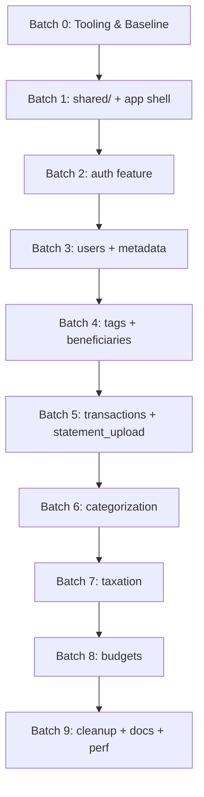

# Frontend Refactoring Plan

> [!NOTE]
> **Planning resolved 2026-05-24.** Modelled on
> [`backend/docs/refactor/implementation_plan.md`](../../../backend/docs/refactor/implementation_plan.md).
> Every `TODO(planning)` from the original scaffold is now locked — see the
> [decision table in CONTRIBUTING.md §10](../../CONTRIBUTING.md#-10-architectural-decisions-resolved--planning-session-2026-05-24).
> Batch 0 is fully specified below; Batches 1–9 will be refined in their own
> sessions.

---

## Goal

Reshape `frontend/src/` from a "by-technical-layer" tree
(`pages/`, `components/`, `state/`, `utils/`) into a **feature-based**
layout under `src/features/<feature>/` that mirrors `backend/app/modules/`.
Along the way, resolve the cross-cutting decisions captured in
[`CONTRIBUTING.md` §10](../../CONTRIBUTING.md): state library, form library,
styling, linting, TypeScript.

**No new product features in this refactor.** Compatibility with the
backend's API surface stays unchanged; the changes are structural.

**Visual upgrade rides along.** The refactor is also the opportunity to
shift the app's visual surface to a modern, sleek, premium look — see
[CONTRIBUTING.md §6 "Visual design language"](../../CONTRIBUTING.md#visual-design-language)
for the target language and operating principle. Every component touched
during a feature batch gets its visuals upgraded in the same pass; do not
re-skin the pre-refactor plain look behind Tailwind utilities.

---

## User Review Required & Design Decisions

> [!IMPORTANT]
> **1. Tooling baseline (Batch 0)** — locked. The full toolchain is in
> [CONTRIBUTING.md §3](../../CONTRIBUTING.md#-3-tooling--workflow) and §10.
> Summary: ESLint flat + Prettier, **TypeScript strict** (migrate per-feature
> as each batch moves files), **TanStack Query v5** for server state,
> **Zustand** for client state (first store: `useAuthStore`),
> **react-hook-form + Zod** for forms, **Tailwind v4** for styling,
> **MSW** for backend mocking in tests, `createBrowserRouter` + per-feature
> `RouteObject[]` for routing, **`size-limit`** for the bundle gate.

> [!IMPORTANT]
> **2. Feature naming follows the backend**
> Feature folders use the same vocabulary the backend uses (`auth`, `users`,
> `metadata`, `tags`, `beneficiaries`, `transactions` + `statement_upload/`,
> `categorization`, `taxation`, `budgets`). Anyone working across the stack
> can `cd backend/app/modules/<X>` and `cd frontend/src/features/<X>` and see
> the matching pair.

> [!IMPORTANT]
> **3. Per-batch frontend tests must stay green**
> `npm test` is the gate. Each batch ends with all existing test files
> passing under their new locations.

> [!WARNING]
> **No backend-shape changes in this refactor.**
> If a frontend change requires touching `/api/...` shapes, defer it to a
> backend follow-up rather than coupling the two refactors.

---

## Proposed Refactoring Batches



### Batch 0 — Tooling & Baseline

Order matters: each step assumes the prior one is in place. Land each as its
own small commit so a bisect remains useful.

1. **ESLint + Prettier.** Install: `eslint@^9`, `@eslint/js@^9`,
   `eslint-plugin-react`, `eslint-plugin-react-hooks`,
   `eslint-plugin-jsx-a11y`, `eslint-plugin-import`,
   `eslint-config-prettier`, `prettier`, `prettier-plugin-tailwindcss` (used
   from step 7 onwards but install now to avoid a follow-up config bump).
   **ESLint pinned to v9 deliberately:** ESLint 10 released in early 2026
   but `eslint-plugin-import@2.32.0` and several other plugins still declare
   their peer range as `^9` only — installing `eslint@*` resolves to v10 and
   produces `ERESOLVE` errors. v9 still ships flat config (the planning
   decision); we revisit v10 once the plugin ecosystem catches up.
   Flat config in `eslint.config.js`. `import/no-restricted-paths` rule
   pre-wired with the eventual `features → shared` boundary. Run
   `npm run format -- --write` over the existing tree as a single commit so
   future batches' diffs stay clean.
2. **TypeScript.** Install: `typescript@~5.9` (pinned because
   `openapi-typescript@7.x` does not yet support TS 6.x), `@types/react@^18`,
   `@types/react-dom@^18` (**pinned to v18 to match the React 18.3 runtime
   — installing `@types/react@latest` resolves to v19 and produces
   load-bearing type errors against React 18 code, including the
   `useRef<T>()` signature change and the removal of the implicit `children`
   prop**). `tsconfig.json` with `strict`, `noUncheckedIndexedAccess`,
   `allowJs`, `jsx: "react-jsx"`. Convert `src/main.jsx` → `src/main.tsx`
   and `src/App.jsx` → `src/App.tsx` as the smoke proof. Add
   `vite-tsconfig-paths` if path aliases (`@/...`) are wanted. Strategy for
   batches 1–8: "convert each file as its feature batch moves it" — no
   second sweep.
3. **OpenAPI types.** Install: `openapi-typescript`. `npm script gen:api` →
   `openapi-typescript http://localhost:4000/openapi.json -o src/shared/types/api.ts`.
   Not run in CI; regenerated on demand. Commit the first generation so types
   are available before Batch 1.
4. **TanStack Query.** Install: `@tanstack/react-query` +
   `@tanstack/react-query-devtools`. Wire `QueryClientProvider` in
   `src/App.tsx` (moves to `src/app/providers.tsx` in Batch 1). Sensible
   defaults: `staleTime: 30_000`, `refetchOnWindowFocus: false`, retry: 1.
   Smoke test: a `useQuery` against a stub endpoint in MSW (step 8).
5. **Zustand.** Install: `zustand`. Skeleton `src/state/auth.store.ts` (no
   real login wiring yet; just `user: null` + a `set` action). Moves to
   `src/features/auth/state/` in Batch 2. Smoke test asserts the store
   exists and updates.
6. **react-hook-form + Zod.** Install: `react-hook-form`, `zod`,
   `@hookform/resolvers`. No code yet — confirmed by `tsc --noEmit`.
7. **Tailwind CSS v4.** Install: `tailwindcss@4`, `@tailwindcss/vite`. Add
   the Vite plugin in `vite.config.ts`. Create `src/index.css` with
   `@import "tailwindcss";` and an empty `@layer components`. Replace one
   existing button's CSS with Tailwind utilities as smoke proof. Configure
   `prettier-plugin-tailwindcss` in `.prettierrc`.
8. **MSW.** Install: `msw`. Create `src/test/server.ts`,
   `src/test/handlers/health.ts` (one stub endpoint),
   `src/setupTests.ts` updated to start/stop the server with
   `beforeAll`/`afterAll` and `resetHandlers` between tests. Convert the
   existing `vi.mock(apiClient)` tests **only if** trivial; defer the bulk
   migration to each feature's batch.
9. **size-limit.** Install: `size-limit`, `@size-limit/preset-app`.
   `.size-limit.json` with two entries: initial bundle ≤ 120 KB gz,
   per-feature lazy chunk ≤ 80 KB gz. **Not yet a CI gate** — Batch 9 wires
   that. Record current numbers in `docs/performance.md`.
10. **Docs skeleton.** Create `frontend/docs/{architecture,testing,performance}.md`
    and an empty `frontend/docs/modules/` folder. `architecture.md` gets a
    one-paragraph stub pointing at CONTRIBUTING.md.
11. **Gate.** `npm run lint`, `npm test`, `npm run build`, `npm run size`
    all green. Commit the final state as
    `Frontend Batch 0: tooling baseline (ESLint, TS, RQ, Zustand, RHF+Zod, Tailwind, MSW, size-limit)`.

### Batch 1 — `shared/` + app shell

- [ ] Create `src/shared/{api,components,hooks,utils,types}/`. (`types/api.ts`
      already exists from Batch 0 step 3.)
- [ ] Move + convert `src/utils/{apiClient,dateUtils,validation}.js` →
      `src/shared/{api,utils}/*.ts`. Update every import.
- [ ] Move + convert `src/components/{ErrorBoundary,ProtectedRoute,PasswordRequirements}.jsx`
      → `src/shared/components/*.tsx`.
- [ ] Carve `src/app/` out of `src/App.tsx`: `App.tsx` (root layout),
      `routes.tsx` (`createBrowserRouter` composer — starts with an empty
      array, populated by feature batches), `providers.tsx` (composed:
      `QueryClientProvider` + global `<ErrorBoundary>` + Suspense fallback +
      `useAuthStore.hydrate()` call on mount).
- [ ] Add a `protectedRoutes(routes)` helper in `src/app/routeHelpers.ts`
      that wraps each `RouteObject` so its `element` is gated by
      `<ProtectedRoute>` — used by Batches 3–8 when their routes are added.
- [ ] **Theme infrastructure (dark / light / system) + header toggle:** - `src/shared/state/theme.store.ts` — `useThemeStore` (Zustand +
      `persist` middleware) with modes `'light' | 'dark' | 'system'`,
      default `'system'`. Subscribes to `prefers-color-scheme` for the
      system mode. - `src/shared/components/ThemeToggle.tsx` — small icon button
      (sun / moon / monitor) cycling through the three modes. Mounted
      top-right of the app header in `src/app/App.tsx`. - Tailwind v4 class-based dark strategy in `src/index.css`:
      `@variant dark (&:where(.dark, .dark *));`. - `index.html` — synchronous inline script (~10 lines) that reads
      the persisted theme from `localStorage` and sets
      `<html class="dark">` _before_ React renders. Prevents FOUC flash
      on initial load. - `src/app/providers.tsx` — `useThemeStore.hydrate()` and effect
      that mirrors store state to the `<html>` class on every change. - Install `lucide-react` (~3 KB tree-shaken) for the icons. Not a
      §10-locked decision; added as the conventional icon dep. - Settings-page placement of the toggle is added later in Batch 3
      when the users feature lands.
- [ ] `npm test` green; no functional change to existing features.

### Batch 2 — `auth` feature

- [ ] Move + convert `src/pages/user/{Login,Register}.tsx` + tests →
      `src/features/auth/pages/`.
- [ ] Move + convert `src/state/AuthContext.jsx` → `src/features/auth/state/auth.store.ts`.
      Replace Context API with the Zustand `useAuthStore` skeleton from
      Batch 0; add real `login`/`logout`/`refresh` actions backed by the
      `api/mutations.ts` hooks. Add `persist` middleware for the access
      token. Delete `AuthContext.jsx`.
- [ ] Move every recovery-related page → `src/features/auth/recovery/`.
- [ ] Extract `src/features/auth/api/`: `schemas.ts` (Zod for login /
      register / recovery request bodies), `queries.ts` (`useCurrentUserQuery`),
      `mutations.ts` (`useLoginMutation`, `useRegisterMutation`, etc.),
      `keys.ts`. All inline fetch sites migrate to these hooks.
- [ ] Rebuild forms with `react-hook-form` + `zodResolver` against the same
      schemas.
- [ ] `src/features/auth/auth.routes.tsx` exports a `RouteObject[]` with a
      per-route `errorElement` (`<AuthErrorFallback />`). Consumed by
      `src/app/routes.tsx`.
- [ ] MSW handlers under `src/test/handlers/auth.ts`. Drop the per-test
      `vi.mock(apiClient)` calls.
- [ ] `npm test` green.

### Batch 3 — `users` + `metadata` features

- [ ] Move `src/pages/user/ProfilePage.jsx` + tests → `src/features/users/pages/`.
- [ ] If the registration form's country/currency dropdowns currently live in
      `Register.jsx`, factor them out into `src/features/metadata/components/`
      (CountrySelect, CurrencySelect — both consume `/api/metadata/*`).
- [ ] Surface the new `symbol` field on `/api/metadata/currencies` somewhere
      visible (e.g. in the currency dropdown label).
- [ ] `npm test` green.

### Batch 4 — `tags` + `beneficiaries` features

- [ ] Move `src/pages/user/settings/CategoriesTab.jsx` (tags UI) →
      `src/features/tags/`.
- [ ] Move `src/pages/beneficiaries/*` → `src/features/beneficiaries/`.
- [ ] Add `src/features/<feature>/api/` for each.
- [ ] `npm test` green.

### Batch 5 — `transactions` + `statement_upload`

- [ ] Move `src/pages/transactions/*` → `src/features/transactions/pages/`.
- [ ] Statement-upload UI nests as `src/features/transactions/statement_upload/`
      to mirror the backend.
- [ ] Add `src/features/transactions/api/` (list / get / create / update /
      delete + statement-upload pipeline).
- [ ] `npm test` green.

### Batch 6 — `categorization`

- [ ] Move `src/pages/user/settings/CategorizationRulesTab.jsx` →
      `src/features/categorization/`.
- [ ] `npm test` green.

### Batch 7 — `taxation`

- [ ] Move `src/pages/tax/*` → `src/features/taxation/pages/`.
- [ ] Surface taxation rules + consumption-tax bills under a single feature
      route group.
- [ ] `npm test` green.

### Batch 8 — `budgets`

- [ ] Move `src/pages/budgets/*` → `src/features/budgets/`.
- [ ] `npm test` green.

### Batch 9 — Cleanup, Docs, Performance

- [ ] Delete the now-empty `src/{pages,components,state,utils}/` directories.
- [ ] Verify zero remaining imports from the old paths (ESLint
      `import/no-restricted-paths` should already enforce this, but grep
      `src/(pages|components|state|utils)/` to be safe).
- [ ] Final docs pass — every `docs/modules/<feature>.md` page mirrors the
      backend's per-module page in shape (Purpose / Pages / Components /
      Hooks / API / Tests).
- [ ] Promote `size-limit` from local-only to a CI gate. Fail the build if
      the initial bundle exceeds 120 KB gz or any per-feature lazy chunk
      exceeds 80 KB gz.
- [ ] Lighthouse audit; record numbers in `docs/performance.md`.
- [ ] Wire `vitest --coverage` with the §7 targets (80% critical-path,
      60% elsewhere). Record in `docs/testing.md`.
- [ ] Monitor risky surfaces in production / dev usage: **Statement Upload**
      (file parsing, multi-step async) and **Weekly Tax generation**
      (background work, cross-module data). If either crashes more than
      occasionally, add a sub-route `<ErrorBoundary>` inside the page rather
      than relying only on the per-feature `errorElement`.
- [ ] Run `npm test` + `npm run build` + full app smoke test against a live
      backend before signing off.

---

## Verification Plan

```bash
cd frontend
npm test                                          # vitest run (gate per batch)
npm run build                                     # bundle must build
npx vitest run src/features/<feature>/<file>      # focused run during batch
```

Manual smoke-test loop (start backend + frontend, click through each
feature) is the closing gate for Batch 9.

---

## Frozen baseline

Before starting Batch 0, commit the current frontend on its own commit:

```text
Frontend: keep parity with backend Batches 1-7 (async + metadata symbol)
```

That commit is the **rollback point** if the refactor goes sideways.
